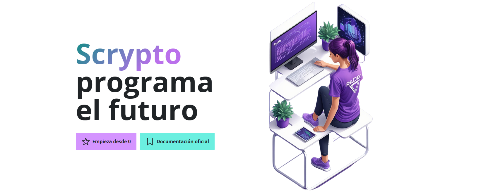

# Aprende Scrypto

Scrypto es un lenguaje de programación orientado a activos creado por RadixDLT que permite crear contratos inteligentes de forma segura e intuitiva.

🚀 [https://aprendeScrypto.com/](https://aprendeScrypto.com/)

## Caracteristicas

-  ♿ Este proyecto está pensado para que sea completamente: ACCESIBLE
- El español es el idioma utilizado
- Curso de iniciacion a la programación de contratos inteligentes con Scrypto
- Curso básico de Rust
- Contiene un pack para que en pocas horas cualquiera pueda utilizar las herramientas de RadixDLT, como Scrypto, en un Hackathon.
- Incluye multiples recursos de programación específicos para este contexto.

## 🚀 Clonar repositorio

Si por algún motivo quieres clonar este sitio localmente ejecuta cualquiera de los siguientes comandos en tu terminal:

| Command           | Action                                       |
| :---------------- | :------------------------------------------- |
| `npm install`     | Instalar dependencias                        |
| `npm run dev`     | Starts local dev server at `localhost:4321`  |
| `npm run build`   | Build your production site to `./dist/`      |
| `npm run preview` | Preview your build locally, before deploying |

## ❤️ Ayudanos / Helping out 

ES: Si descubre que algo no funciona bien, ¡siempre estaré feliz de escucharlo para mejorar este curso! Puedes contribuir de muchas maneras y formas. Déjamelo saber por:

UK: If you find something isn't working right, I'm always happy to hear from you to improve this course! You can contribute in many ways and forms. Let me know by:

1. [Filing an issue](https://github.com/aprendeScrypto/webSite/issues)
2. [Submitting a pull request](https://github.com/aprendeScrypto/webSite/pulls)
3. [Starting a discussion](https://github.com/aprendeScrypto/webSite/discussions)

## Gracias!
[markteekman](https://github.com/markteekman) por crear la plantilla que estamos utilizando. Poder dar forma a un proyecto de manera tan fácil y además siendo accesibles a todo el mundo es maravilloso. 

